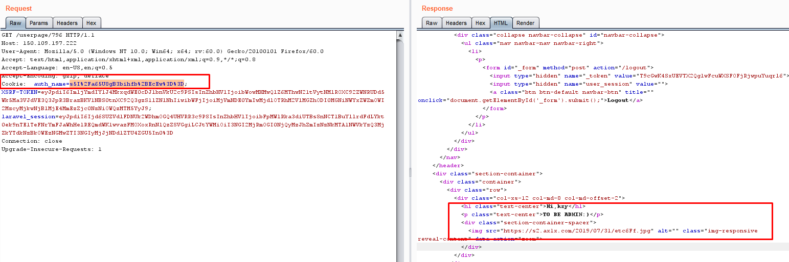
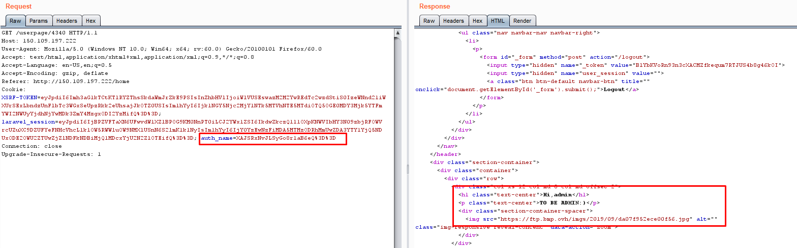

#Old Attack(step1)
The web is down now, so I will show some capture from my burpsuite
When login to the website, the userpage at 150.109.197.222/userpage/796 show a text Hi,kzy >TO BE ADMIN:)

You can see auth_name cookie. This is not change after every request. So I think they use the algorithm to encrypt message without random value. => This is the first think!  
The second, I saw the web is using laravel framework, and the default algorithm used is AES
So the Idea is: I decide create a long name to check if this cookie use which AES mode and I found they are using AES mode ECB.

This algorithm decrypt/encrypt as block, so if you know the block size you will create a specific ciphertext you want.
The ciphertext that I want is "admin".
when I add 255 charater "a" as username. the auth_name is:
```
/IxmlZ2Od/YDGxEIvA5vq/yMZpWdjnf2AxsRCLwOb6v8jGaVnY539gMbEQi8Dm+r/IxmlZ2Od/YDGxEIvA5vq/yMZpWdjnf2AxsRCLwOb6v8jGaVnY539gMbEQi8Dm+r/IxmlZ2Od/YDGxEIvA5vq/yMZpWdjnf2AxsRCLwOb6v8jGaVnY539gMbEQi8Dm+r/IxmlZ2Od/YDGxEIvA5vq/yMZpWdjnf2AxsRCLwOb6v8jGaVnY539gMbEQi8Dm+r/IxmlZ2Od/YDGxEIvA5vq/yMZpWdjnf2AxsRCLwOb6v8jGaVnY539gMbEQi8Dm+rm3uAxwpX2swVtiiJzRSQ2w==
```
you can see the blocksize is 48 byte. => the payload you need to create is 48*"a"+"admin"

So you can see the image of the flag when you can auth_name to admin
the code check you can see is:
```php
.......
public function userpage(Request $request,$id)
    {   
        if($request->isMethod('get')){
          if(isset($_COOKIE['auth_name'])){
            $auth_check=$this->decrypt($_COOKIE['auth_name']);}else{
            $auth_check=Auth::user()->name;
          }
          if($auth_check==='admin'){
              $imgurl="";
              $usern='admin';
              ......
 ```         
